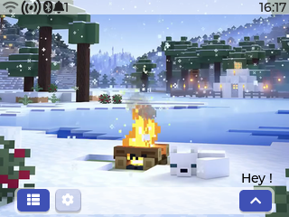

# FlxOS Labs Website

<div align="center">
  
</div>

<div align="center">
  <strong>The showcase website for <a href="https://flxos-labs.github.io/">FlxOS</a> — a modular, profile-driven operating system for ESP32 and Desktop platforms.</strong>
</div>

<br />

## 🌟 Overview

This repository hosts the static website for FlxOS Labs, detailing the FlxOS project, its features, and development roadmap. The website is built with a focus on premium aesthetics, featuring modern web design practices, complex animations, and an interactive presentation of the OS.

Live Website: [flxos-labs.github.io](https://flxos-labs.github.io/)

## ✨ Key Design Features

- **Animated Gradient Mesh**: A dynamic, ambient background that subtly shifts using CSS animations.
- **3D Device Mockups**: Premium presentations of the OS interface using realistic device frames, screen glare, and glow effects.
- **Bento Grid Layout**: A modern, asymmetrical grid showcasing core capabilities and feature highlights.
- **Interactive Component State**:
  - Horizontal carousel for the screenshot gallery.
  - Step-by-step interactive installation guide with a built-in terminal UI.
  - Dynamic theme toggler (Dark / Light modes).
- **Interactive Tech Stack Cloud**: SVG logos with hover tooltips demonstrating the technologies powering FlxOS.
- **GitHub API Integration**: Real-time fetching of repository statistics (stars, forks, watchers, contributors) and latest release data.

## 🛠️ Tech Stack

The site is built entirely without heavy frontend frameworks to ensure maximum performance and maintainability:

- **HTML5**: Semantic and accessible markup with SEO optimization built-in.
- **Vanilla CSS**: Custom design system built with CSS variables, flexbox/grid, and complex keyframe animations.
- **Vanilla JavaScript (ES6+)**: Handles all interactivities, carousels, theme toggling, and API fetching.
- **Prism.js**: For terminal syntax highlighting in the Get Started section.
- **Font Awesome**: High-quality iconography across the platform.

## 📂 Project Structure

```text
.
├── index.html          # Main landing page
├── script.js           # Interactive components & API fetches
├── styles.css          # Core design system and global styles
├── README.md           # This file
├── docs/               # Documentation section
├── about/              # About section
└── flxos_screenshots/  # High-quality UI captures used in the gallery
```

## 🚀 Local Development

To run the site locally, you can use any basic HTTP server. For example, using Python:

```bash
# Clone the repository
git clone https://github.com/flxos-labs/flxos-labs.github.io.git
cd flxos-labs.github.io

# Start a local development server
python3 -m http.server 8080
```

Then visit `http://localhost:8080` in your web browser.

## 📄 License

This website's content and the FlxOS project itself are released under the **AGPL-3.0** License.
