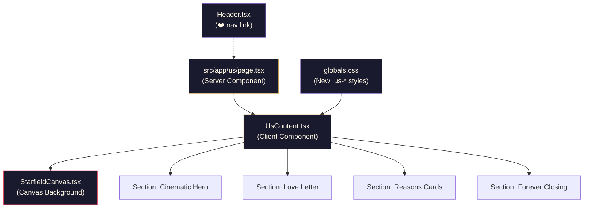

# 💫 "To the One Who Stole My Heart" — Dedicated Page for Rekha

A cinematic, luxurious, one-of-a-kind dedication page at `/us` that will absolutely blow her away. Dark-mode dominant with golden accents, parallax depth, and premium animations that feel like a movie intro.

## Design Vision


The page should feel like opening a luxury gift box — each section reveals something more beautiful. The aesthetic is:
- **Color palette**: Deep blacks (`#0a0a0c`), rich golds (`#d4a853`, `#f5d799`), warm rose (`#e8475f`), soft champagne (`#fdf6e3`), twilight purple (`#7c5cbf`)
- **Typography**: The existing `Space Grotesk` display font for headlines + `Figtree` body — both already loaded in the project
- **Mood**: Cinematic, intimate, luxurious — like a movie title sequence
- **Animations**: Scroll-triggered reveals, parallax layers, floating golden particles, and a stunning entrance sequence

---

## Proposed Changes

### Route & Page Structure

#### [NEW] [page.tsx](file:///home/akash/flxos-labs/flxos-labs.github.io/src/app/us/page.tsx)
Server component with custom metadata:
- Custom `<title>`: "For You, Rekha ❤️"
- Custom OG tags for a beautiful link preview if shared
- Imports and renders `<UsContent />`

#### [NEW] [UsContent.tsx](file:///home/akash/flxos-labs/flxos-labs.github.io/src/app/us/UsContent.tsx)
The main client component (`"use client"`) — the heart of the page. Contains all sections:

**Section 1 — Cinematic Entrance Hero**
- Full-viewport dark section with a subtle golden particle canvas background
- Animated headline: "To the One Who Stole My Heart" — text reveals letter by letter with a golden shimmer
- Subtle parallax depth on scroll
- Scroll prompt directing users downward to reveal the content and photos

**Section 2 — The Love Letter**
- A beautifully typeset heartfelt message on what appears to be a luxurious dark card with gold borders
- Text fades in paragraph by paragraph as you scroll
- Elegant gold decorative dividers between paragraphs
- Signature at the bottom: "Yours forever, Akash" in a handwriting-style italic

**Section 3 — "Reasons I Love You" Cards**
- 8-10 beautifully crafted poetic reasons
- Each reason is a glassmorphic card with:
  - A gold accent number (01, 02, 03...)
  - A poetic title
  - A short, heartfelt description
- Cards animate in one by one on scroll (staggered reveal)
- Each card has a subtle hover effect — lift + golden border glow
- On mobile: cards stack vertically with swipe hints

**Section 4 — "Yours Forever" Closing**
- A final dramatic section showing both photos (me.jpg & her.jpg) inside glassmorphic frames in a creative collage-style layout
- Rekha's photo features a gentle golden pulse/glow effect
- An animated infinity symbol (∞) drawn in gold
- "Yours forever, Akash" in elegant typography
- Floating golden sparkles around the section

---

#### [NEW] [StarfieldCanvas.tsx](file:///home/akash/flxos-labs/flxos-labs.github.io/src/app/us/StarfieldCanvas.tsx)
A dedicated canvas component for the page's background:
- Renders golden particles that drift upward slowly
- Subtle twinkling star effect
- Reacts to mouse movement with gentle parallax
- Spawns golden sparkles on mouse trail (similar to the existing `InteractiveBackground` but with a gold/rose palette)
- Performance-optimized: reduced particle count on mobile, pauses when tab is hidden

---

### CSS

#### [MODIFY] [globals.css](file:///home/akash/flxos-labs/flxos-labs.github.io/src/app/globals.css)
Add a dedicated section at the end for `/us` page styles:

```css
/* ------------------------------------------------------------------ */
/* "For Us" — Dedicated Romance Page                                  */
/* ------------------------------------------------------------------ */
```

Key styles include:
- `.us-page` — Forces dark aesthetic regardless of site theme
- `.us-hero` — Full-viewport intro with radial gradient background
- `.us-photo-frame` — Glassmorphic rounded photo containers with gold border glow
- `.us-letter-card` — Elegant dark card with gold trim for the love letter
- `.us-reason-card` — Glassmorphic reveal cards with staggered `@keyframes`
- `.us-gold-text` — Gold gradient text effect
- `.us-shimmer` — Subtle shimmer animation for gold elements
- `.us-reveal` — Intersection Observer powered scroll-reveal animation
- `.us-parallax-*` — Parallax scroll speed layers
- Responsive breakpoints for all components

Animations planned:
- `@keyframes us-fade-up` — Reveal from below with opacity
- `@keyframes us-shimmer` — Gold shimmer sweep on text
- `@keyframes us-float` — Gentle floating for decorative elements
- `@keyframes us-pulse-glow` — Soft golden pulse on photo frames
- `@keyframes us-letter-reveal` — Letter-by-letter text reveal
- `@keyframes us-draw-infinity` — SVG path draw for ∞ symbol

---

### Navigation Integration

#### [MODIFY] [Header.tsx](file:///home/akash/flxos-labs/flxos-labs.github.io/src/components/Header.tsx)
- Add a subtle ❤️ icon link to `/us` in the header navigation
- On desktop: appears as a small heart icon after the other nav links, with a subtle pulse animation on hover
- On mobile drawer: appears at the bottom of the nav links with a "For Us ❤️" label
- The heart has a warm rose/gold color that stands out subtly

---

## Content — "Reasons I Love You"

Here are the 8 poetic reasons I'll craft:

| # | Title | Theme |
|---|-------|-------|
| 01 | "Your Smile Rewrites My Worst Days" | Her smile's power to transform everything |
| 02 | "You Make Silence Feel Like Poetry" | Comfort in quiet moments together |
| 03 | "Your Courage Inspires My Ambition" | How her strength pushes him to be better |
| 04 | "You See the Me I'm Still Becoming" | Her belief in his potential |
| 05 | "Your Laughter Is My Favorite Sound" | The joy her laughter brings |
| 06 | "You Turn Ordinary Into Extraordinary" | How she makes simple moments magical |
| 07 | "Your Heart Knows Mine Before I Speak" | Deep intuitive connection |
| 08 | "You Are My Calm in Every Storm" | Being his anchor and peace |

---

## Technical Architecture



---

## Key Technical Details

### Scroll-Triggered Animations & Snapping
- Using `IntersectionObserver` API to trigger `.us-reveal` class additions
- Staggered delays using CSS custom properties (`--reveal-delay: 0.1s`, `0.2s`, etc.)
- Smooth `translateY` + `opacity` transitions
- Native CSS Scroll Snapping enabled on desktop viewports (`scroll-snap-type: y mandatory`) with a `scroll-margin-top` offset to account for the sticky header

### Forced Dark Theme
- The `/us` page wrapper applies `data-theme="dark"` inline + forces its own dark CSS variables
- This ensures the page ALWAYS looks cinematic regardless of the user's theme preference
- The existing `InteractiveBackground` canvas will be hidden on this page (the custom `StarfieldCanvas` replaces it)

### Performance Considerations
- StarfieldCanvas uses `requestAnimationFrame` with `visibility` pausing
- Reduced particle counts on mobile (`window.innerWidth < 768`)
- CSS `will-change` on animated elements, removed after animation completes
- Images use Next.js `<Image>` with lazy loading for collage photos at the bottom of the page

### Responsive Design
- Mobile-first approach
- Collage photos stack vertically on mobile, side-by-side on desktop
- Reason cards: 1 column mobile → 2 columns tablet → 3-4 columns desktop
- Font sizes scale with `clamp()` for fluid typography

---

## Files Changed Summary

| File | Action | Description |
|------|--------|-------------|
| `src/app/us/page.tsx` | **NEW** | Server component with SEO metadata |
| `src/app/us/UsContent.tsx` | **NEW** | Main client component — all sections |
| `src/app/us/StarfieldCanvas.tsx` | **NEW** | Golden particle canvas background |
| `src/app/globals.css` | **MODIFY** | Add `.us-*` romance page styles |
| `src/components/Header.tsx` | **MODIFY** | Add ❤️ nav link to `/us` |

---

## Verification Plan

### Automated Tests
- Run `npm run build` to verify no TypeScript/build errors
- Run `npm run dev` and verify the page loads at `localhost:3000/us`

### Manual Verification  
- Check all animations trigger correctly on scroll
- Verify responsive layout on mobile viewport
- Confirm forced dark theme works even when site is in light mode
- Test the ❤️ navigation link in both desktop and mobile drawer
- Verify photos load correctly
- Check performance (no jank on scroll animations)

---

> [!TIP]
> Once approved, I'll build this section by section, starting with the CSS design system tokens, then the StarfieldCanvas, then the main content component, and finally the navigation integration. Each section will be polished before moving to the next.
