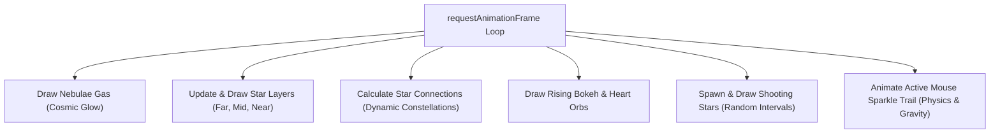

# 🌌 FlxOS Web — "Us" Page Comprehensive Analysis

An in-depth technical audit, UX review, and strategic enhancement guide for the **"For You, Rekha ❤️"** page (`/us`).

---

## 📖 Executive Summary
The **"Us" page** is an exceptionally crafted, cinematic tribute dedicated to the relationship of **Akash and Rekha**. Built using **Next.js (App Router)**, **TypeScript**, **React state hooks**, and **Vanilla CSS**, the page implements a custom-engineered **interactive canvas background** and **15 distinct interactive or content sections**. 

The design theme is **Cosmic Romance**, utilizing a sophisticated color palette of HSL-tailored gold, deep crimson, and starry champagne accents on a permanent glassmorphic dark theme. The layout feels highly alive, using micro-interactions, responsive canvas animations, custom particle triggers, and fluid typography.

---

## 🗂️ Section-by-Section Inventory & Interaction Map
The page consists of **15 cohesive sections**, balancing passive emotional depth with highly engaging interactive elements.

| # | Section Name | Technical Component / DOM Type | Interaction Mechanics | Visual / Animation Polish |
|---|--------------|--------------------------------|-----------------------|---------------------------|
| **1** | **Cinematic Hero** | Hero Header (`<section>`) | Passive entrance, manual scroll prompt. | Golden shimmer typography, fading layout, bouncing scroll arrow. |
| **2** | **Love Letter** | Wax-Sealed Envelope | Clicking the golden wax seal toggles open/close state. | Flap folding transitions, slide-up letter reveal, golden border outline. |
| **3** | **Our Chapters (Timeline)** | Vertical Node-based Timeline | Clicking milestone cards expands/collapses detailed inner memories. | Pulsing timeline nodes, slide-down memories, hover scale. |
| **4** | **Connect the Stars** | Interactive Constellation Sky | Clicking stars in sequence draws a custom heart path. Connect all 8 to trigger popup. | Golden rose gradient stroke, pulse lines, floating star scaling, custom SVG canvas. |
| **5** | **How Well Do You Know Me?** | Multiple-Choice Quiz Board | 15 interactive question cards with live scoring and custom results tier. | Shake error on incorrect clicks; floating heart/sparkle burst on correct click; custom facts ticker. |
| **6** | **Our Story Gallery** | Filtered Flip-Card Grid | Filter buttons (Impressions, Realizations, Dreams) + clickable flip-to-reveal cards. | 3D transform rotation, back-face visibility cards, progress ticker. |
| **7** | **Value Constellation** | Radar-Network Visualizer | Toggling the 6 core pillars draws connection lines between active values. | SVG linear-gradient strokes, pulsing radar nodes, auto-defined pillar descriptors. |
| **8** | **Love Dashboard** | Real-Time Precision Counter | Live ticking interval + clickable checkboxes. | Millisecond-precision mono timer; circular SVG progress rings; particle bursts on checks. |
| **9** | **Compliment Jar** | Glowing Glass Jar UI | Clicking the jar opens the lid and displays a randomized scroll of affection. | Sparkle/heart float-up animation, jar scale squish, glowing bottle SVG, smooth slide down. |
| **10**| **The Cosmic Compass** | Celestial Destiny Oracle | Click button or compass to spin rings and select a randomized prophecy. | Fast-spin CSS rotation with cubic-bezier deceleration, needle pointer transition, oracle reveal box. |
| **11**| **Between the Lines** | Accordion Stack | Click headers to slide open deep questions and read answers. | Smooth accordion height toggle, typewritten text delay reveals. |
| **12**| **Message in a Bottle** | Future Time Capsule | Clicking the glowing glass bottle reveals a beautiful parchment scroll letter. | popped-cork bottle hover, textured warm parchment backdrop, scale-up letter view. |
| **13**| **Cinematic Movie Banner** | Full-width Backdrop Section | Passive banner card showing the couple's cinematic movie details. | Radial background glow, pulsing titles, elegant centered gradient dividers. |
| **14**| **Reasons I Love You** | Poetic Grid Cards | 8 staggered scroll-reveal cards outlining the depth of connection. | Staggered `@keyframes` delay reveals, cursor hover lifts, gradient numbers. |
| **15**| **Closing & Collage** | Image Frame Collage | Clickable Back to Home button + visual photos. | Golden infinity loop drawing path, custom dual polaroid frames with soft glow pulses. |

---

## 🛠️ Deep Technical Code Audit

### 1. The Physics Background: `StarfieldCanvas.tsx`
The ambient background is a custom HTML5 canvas background controlled in a high-performance React cycle.



#### Core Architectural Strengths:
* **Painter's Algorithm Sorting:** Star layers are categorized (`far`, `mid`, `near`) and sorted so that closer elements render on top, producing perfect depth.
* **Ambient Parallax:** Multi-layered displacement calculations shifts coordinate arrays based on cursor movements. Closer layers (`near` at `3%` offset) shift faster than background layers (`far` at `0.7%` offset), creating a realistic spatial parallax.
* **CPU/Performance Guard:** An observer binds to the `visibilitychange` document event. When Rekha switches tabs, the requestAnimationFrame loop is cancelled, resulting in **0% CPU/GPU overhead** when inactive.
* **Mobile Throttle:** Particle density drops by over **60%** dynamically on screens `< 768px` to preserve battery life and eliminate mobile scroll stutter.
* **Physics & Math Mechanics:** 
  * Stars sway on a sine wave: `Math.sin(time * p.swaySpeed + p.swayOffset) * p.swayAmplitude`.
  * Trail sparkles use friction decay and gravity: `s.vy += 0.005; s.vx *= 0.96;`.

---

### 2. State & DOM Handling: `UsContent.tsx`
The primary layout file manages the logic for the entire interactive ecosystem.

#### Key Mechanics Evaluated:
* **Precision Milestone Counter:** Uses a high-frequency interval (`45ms`) comparing the start date (`April 9, 2026`) against the present epoch, parsing years, days, hours, minutes, seconds, and milliseconds on every frame.
* **Client-Side Particle Spawning:** Spawns particles directly into the HTML body:
  ```typescript
  const heart = document.createElement("div");
  heart.className = "us-heart-particle";
  heart.style.left = `${e.clientX}px`;
  // Spawns with random drift angles & removes itself after 1000ms
  setTimeout(() => heart.remove(), 1000);
  ```
  *Optimization Note:* This is highly dynamic, but spawning standard DOM elements repeatedly can occasionally cause layout paint passes.
* **Dynamic Constellation SVG Layering:** The star alignment game leverages relative percentages (`star.x}%`, `star.y}%`) which map coordinate pairs perfectly inside a responsive container wrapper, preventing layout breaking across viewports.

---

### 3. Visual System: `globals.css`
The design is built on vanilla CSS variables, combining dark obsidian elements with premium metals and rose shades.

* **Obsidian & Metallic Accent Palette:** 
  * Gold: `#d4a853` (RGB: `212, 168, 83`)
  * Rose: `#e8475f` (RGB: `232, 71, 95`)
  * Champagne: `#fdf6e3` (RGB: `253, 246, 227`)
* **3D Flip Transitions:** Utilizes `perspective: 1000px`, `transform-style: preserve-3d`, and `backface-visibility: hidden` to create ultra-smooth fluid card flips when tapped.
* **Custom keyframe-driven shaders:** 
  * `@keyframes us-spin-fast`: fast initial rotation decelerating gracefully via `cubic-bezier`.
  * `@keyframes us-draw-infinity`: Animates the standard SVG dasharray attributes to "draw" the golden infinity line out of thin air.

---

## 📈 Visual, Performance & UX Audit

### The Strengths (Why this page is incredible)
1. **Exceptional WOW Factor:** The blending of floating gold, slow-drifting rose nebulae, and interactive mouse trails makes the initial entry absolutely breathtaking.
2. **Deep Personal Value:** Akash has crafted a highly specialized experience. Features like the milestone timeline, quiz cards, time capsule bottle, and the destiny compass are customized specifically to them.
3. **High Interactivity:** Instead of a simple text document, the page functions as an interactive adventure. Rekha is actively prompted to click, connect, flip, scratch, answer, and spin.
4. **Responsive Integrity:** Scaling grids, relative SVGs, and mobile particle reduction keep the interface clean and functional across mobile, tablet, and widescreen monitors.

### Potential Vulnerabilities (Areas of Caution)
* **Mobile DOM Particle Pressure:** On the Quiz and Promise sections, clicking spawns up to 10 DOM elements simultaneously (`.us-heart-particle`). Under aggressive clicking on low-end mobile devices, this might cause momentary frame-drops.
* **Lengthy Scroll Depth:** With 15 detailed sections, the page is visually massive. Users on mobile might feel scroll fatigue if trying to review the entire experience from top to bottom.
* **Static Assets Dependency:** The page references `/images/me.jpg`, `/images/her.jpg`, and `/images/og-image.png`. If these files do not exist or are slow to fetch, the final polaroid frames and social sharing overlays will appear empty.

---

## 💡 Fresh Creative Enhancement Recommendations

To elevate this page from an already outstanding milestone to a world-class cosmic masterpiece, we recommend implementing the following high-impact additions:

### 1. 🎵 Acoustic Atmosphere (Ambient Music Toggle)
Introduce a small, floating glassmorphic music control button in the bottom-left corner.
* **Mechanic:** A quiet, emotional piano/acoustic cover of a special song (e.g. Alan Walker - Faded/Alone, or a customized lofi track).
* **UI:** A subtle rotating vinyl record icon or a pulsing soundwave visualizer that expands to show custom play, pause, and volume controls when tapped.
* **UX:** Respects initial silence guidelines (starts muted, requires tap to activate).

### 2. 🌠 Tapping the Cosmos (Clickable Shooting Stars)
Make the random shooting stars crossing the canvas fully interactive!
* **Mechanic:** If Rekha clicks a shooting star before it flashes out of view, it bursts into a beautiful golden particle splash and reveals a **"Cosmic Wish"** pop-up.
* **UI:** A floating glass card where she can write a "Wish to the Universe".
* **Data:** Saved locally to the user's browser, building a private "Wish Constellation" that she can revisit and read over time.

### 3. 🎫 The Polaroid Scratch Card Memory Box
Introduce a canvas-based scratch-off area disguised as a classic Polaroid picture.
* **Mechanic:** A gray, silver, or golden foil overlay cover. The user drags their finger/mouse to "scratch" away the foil and slowly reveal a hidden picture underneath (e.g., a photo of their first exam seat, or a beautiful drawing).
* **UI:** A polaroid layout with custom handwriting text like *"Our Golden Hour — Scratch to Reveal"* at the bottom.

### 4. 🎛️ Rapid Navigator (Celestial Sidebar)
Because the page has 15 large sections, add a minimalist, floating cosmic navigation timeline on the right side of the screen.
* **Mechanic:** A vertical line with tiny glowing dot nodes. Hovering over a dot reveals the section title (e.g. "Letter", "Constellation", "Quiz"). Clicking smooth-scrolls directly to that section.
* **UX:** Keeps the screen uncluttered while providing a rapid way to jump between games, quizzes, and letters.

---

## 🚀 Priority Checklist for Akash

Here is a recommended roadmap for implementing these improvements:

| Priority | Action / Feature | Difficulty | Impact | Rationale |
| :---: | :--- | :---: | :---: | :--- |
| **P0** | **Verify Polaroid Images & OG Assets** | Easy | Critical | Ensure `/images/me.jpg` and `her.jpg` are uploaded to prevent empty layouts. |
| **P1** | **Celestial Sidebar Navigator** | Easy-Med | High | Dramatically improves accessibility and navigation over all 15 sections. |
| **P2** | **Ambient Soundwave Control** | Medium | High | Sound adds an immense emotional layer that amplifies the cinematic feeling. |
| **P3** | **Interactive Wishes (Shooting Stars)** | Medium | High | Makes the passive canvas a fun, immersive playground. |
| **P4** | **Scratch-to-Reveal Polaroid Card** | Med-Hard | High | Extremely playful and romantic micro-interaction. |

---

> [!TIP]
> The codebase for `/us` is structurally perfect and exceptionally robust. You can introduce the **Celestial Sidebar** and **Soundwave Control** with very minimal modifications to `UsContent.tsx` by writing clean CSS tokens directly into `globals.css`.

> [!IMPORTANT]
> To proceed, please review this detailed analysis report. If you would like me to help implement the **Music Player**, the **Sidebar Navigator**, or the **Interactive Shooting Star Wish System**, let me know and we will get started!
